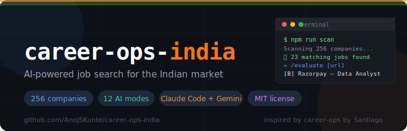

<div align="center">



# career-ops-india

**AI-powered job search pipeline for the Indian market**

Works with [Claude Code](https://claude.ai/code) and [Gemini CLI](https://github.com/google-gemini/gemini-cli) (free).
Scan 60+ Indian company career pages, evaluate fit with a structured rubric,
generate tailored PDFs, track your pipeline, prep for interviews.

Built for early-career folks targeting **data, analytics, and product roles** in India.

[](https://github.com/AnojSKunte/career-ops-india/actions)
[](LICENSE)
[](https://nodejs.org)

Inspired by [career-ops](https://github.com/santifer/career-ops) by Santiago — rebuilt in full for the Indian market.

</div>

---

## What it does

| Command | What happens |
|---|---|
| `npm run scan` | Hits ATS APIs of 230 Indian companies. Returns matching jobs in ~30 seconds. No scraping. No login. |
| `/evaluate [URL]` | Scores a job A–F across 10 dimensions. Flags ghost jobs, wrong level, salary gaps. |
| `/batch [URLs]` | Evaluates up to 30 jobs at once. Ranks them. Cuts the noise. |
| `/pdf [job]` | Rewrites your resume for a specific job — injects JD keywords, reorders bullets, stays truthful. |
| `/tracker` | Logs applications. Tracks stages. Spots stale ones. Shows conversion rates. |
| `/prep [company]` | Interview prep: SQL patterns, case study frameworks, company brief, 48-hr study plan. |
| `/contact` | Outreach messages: LinkedIn cold, referral ask, post-interview thank you, cold email. |
| `/negotiate` | Salary negotiation scripts tuned for India — CTC vs in-hand, ESOPs, joining bonus, "band is fixed" pushback. |
| `npm run dashboard` | Opens a visual pipeline dashboard in your browser. |
| `/audit` | Cold-audits your resume — ATS safety, bullet quality, Indian market red flags. No job needed. |
| `/skills` | Skill gap analysis against what's actually in the job market right now. |
| `/referral [company]` | Finds who to contact at a company and writes the referral message. |
| `npm run liveness` | Checks if your application links are still live. Dead links = job filled. |

---

## How it works

Most tools make you scrape job boards and get blocked. This doesn't.

**Step 1 — Scanner hits ATS APIs directly**

Companies like Razorpay, CRED, Zepto, Postman, and 56 others use Greenhouse, Lever, or Ashby as their applicant tracking system. All three expose clean JSON APIs. The scanner queries them directly — no browser, no CAPTCHA, no getting blocked.

```
node scripts/scan.mjs
→ Razorpay(2) CRED(1) Postman(3) BrowserStack(1) ...
→ 23 matching jobs found. Saved to data/scan_results.json.
```

**Step 2 — AI evaluates each job against your profile**

Open Claude Code or Gemini CLI in this folder. The AI has already read your CV, your target salary, and your skills. Paste a URL or run `/batch` on the scan results.

```
/evaluate https://boards.greenhouse.io/razorpay/jobs/6123456

[B] Razorpay — Data Analyst
Score: 4.1/5.0 | Bangalore | 14–18 LPA

✅ Strong: Python, SQL, pandas, ETL, Metabase — direct matches
⚠️  Partial: dbt mentioned, not in your CV
❌ Gap: 2+ years required, you have 1.5

Salary: Within target range. In-hand ~₹85–95K/month.
Recommendation: APPLY WITH TWEAKS
```

**Step 3 — Tailored resume PDF per job**

```
/pdf razorpay data analyst
→ Rewrites your bullets, injects 5 JD keywords, generates PDF
→ Saved: output/anoj-sk_razorpay_data-analyst_2025-06-01.pdf
```

**Step 4 — Track, prep, negotiate**

Everything stays local. Your pipeline, CV, and reports are gitignored — they never leave your machine.

---

## Setup

### Requirements
- Node.js 18+ → [nodejs.org](https://nodejs.org)
- Claude Code **or** Gemini CLI (free) — at least one
- Git

### Install

```bash
git clone https://github.com/AnojSKunte/career-ops-india
cd career-ops-india
npm install
npm run doctor        # checks everything is ready
```

### Configure

```bash
cp config/profile.example.yml config/profile.yml
```

Edit `config/profile.yml` — add your name, skills, target roles, salary range, locations.

Then edit `cv.md` — replace the placeholder text with your real experience.
The more specific and quantified your CV, the better every evaluation will be.

### First run

```bash
npm run scan
```

No AI key needed for scanning — just Node.js. You'll see matching jobs from 60+ companies in about 30 seconds.

Then open your AI CLI:

```bash
# Claude Code
claude

# Gemini CLI
gemini
```

And run:
```
/evaluate [any URL from the scan results]
```

---

## Slash commands

All commands work identically in Claude Code and Gemini CLI.

```
/evaluate [URL or paste JD text]    Full A–F evaluation, 6-block report
/scan                               Re-scan companies, show new listings
/batch                              Evaluate multiple jobs at once
/pdf [company] [role]               Generate tailored resume PDF
/tracker                            Log an update to your pipeline
/pipeline                           View your full application dashboard
/prep [company] [role]              Interview preparation
/contact                            Write outreach messages
/negotiate                          Salary negotiation scripts
```

---

## npm scripts

```bash
npm run scan          # Scan 60+ company ATS APIs for matching jobs
npm run doctor        # Check setup: Node version, files, CLI, Puppeteer
npm run dashboard     # Open visual pipeline dashboard in browser
npm run liveness      # Check if job application links are still live
npm run verify        # Validate data/pipeline.json integrity
npm run dedup         # Remove duplicate pipeline entries
npm run sync-check    # Check cv.md and profile.yml are in sync
npm run pdf           # Generate PDF (usually called via /pdf in AI CLI)
```

---

## Company coverage

**230 Indian companies pre-configured** across 3 ATS systems:

| ATS | Companies (sample) |
|---|---|
| Greenhouse (89) | Razorpay, BrowserStack, Postman, Freshworks, Chargebee, MoEngage, Clevertap, Darwinbox, Innovaccer, Gupshup, Fractal Analytics, InMobi, Perfios, upGrad, Scaler, Sigmoid, DataWeave, Axtria, Classplus, Teachmint + 59 more |
| Lever (82) | CRED, Groww, Zepto, Meesho, MakeMyTrip, Ola Electric, Tata 1mg, Urban Company, Delhivery, BlackBuck, PharmEasy, NoBroker, Shiprocket, Moglix, Ofbusiness, Bizongo + 54 more |
| Ashby (59) | Sarvam AI, Krutrim, Ola, Smallcase, Jar, Fi Money, Slice, INDmoney, Digit Insurance, Yellow.ai, Ather Energy, ShareChat, Apna, Pocket FM, Khatabook + 32 more |

**To add a company:** find their careers URL, identify the ATS from the domain, add a 4-line entry to `portals/india.yml`. That's it.

---

## Sources covered

## Full source coverage

| Source | Command | What it covers |
|---|---|---|
| Greenhouse / Lever / Ashby |  | 256 pre-mapped Indian companies |
| LinkedIn |  | All of LinkedIn, public data, no login |
| Instahyre |  | Quality Indian tech/startup platform |
| Cutshort |  | Startup roles, skills-based matching |
| Wellfound |  | Funded global startups, India filter |
| Naukri |  | 1cr+ listings (needs Python + Scrapling) |

Run all at once: 

---

### ATS companies (Greenhouse / Lever / Ashby) — `npm run scan`
The cleanest, most reliable source. Companies post jobs directly to their ATS. The scanner hits the JSON APIs — no browser, no CAPTCHA, instant results.

### LinkedIn — `npm run scan:linkedin`
Uses LinkedIn's public guest API (`/jobs-guest/`). The same endpoint Google uses to index jobs. No login. No account. No cookie management. Parses HTML card responses. Adds 2–5s delay between requests to stay within rate limits.

```bash
npm run scan:linkedin
# Searches 10+ query variations across your target roles
# Adds results to data/scan_results.json
# Takes ~5 minutes
```

### Naukri — `npm run scan:naukri`
Naukri has no public API. This uses Playwright to simulate a real browser. Slow by design — adds 5–10s delays to avoid detection.

```bash
# First time only:
npm install playwright
npx playwright install chromium

# Then:
npm run scan:naukri
# Takes 10–15 minutes
# Set HEADLESS=false in scripts/naukri.mjs if getting blocked
```

> Note: Naukri's ToS prohibits scraping. Use for personal job search only, not for commercial data collection.

---

## Why not just scrape Naukri / LinkedIn?

You could. There are two problems:

1. **Reliability.** Naukri uses Cloudflare + fingerprint detection. LinkedIn actively litigates against scrapers. Any scraper breaks within weeks when they update their frontend. You'd spend more time fixing the scraper than job hunting.

2. **Signal quality.** The companies worth targeting at your experience level — Razorpay, CRED, Zepto, Postman — all have ATS systems this scanner queries directly. Their listings are cleaner, more accurate, and have apply links that actually work.

Naukri is a volume play. ATS-first is a quality play. This tool optimizes for the latter.

---

## Evaluation criteria (what A–F actually means)

Every job is scored across 10 dimensions:

| Dimension | Weight | What it checks |
|---|---|---|
| Role-skill match | 25% | Do day-to-day tasks match your actual skills? |
| Salary fit | 20% | Is CTC within or above your target range? |
| Tech stack overlap | 15% | Do the specific tools in the JD match what you have? |
| Growth trajectory | 10% | Will this role develop skills in your target direction? |
| Company tier/health | 10% | Funding stage, revenue signals, layoff risk |
| Location/remote | 5% | Matches your preference? |
| JD quality | 5% | Is the role well-defined? Vague JDs = unclear expectations |
| Experience fit | 5% | Does required experience match yours? |
| Resume gap | 3% | Hard requirements you lack entirely |
| Legitimacy | 2% | Is this a real, active job? (ghost job detection) |

**Grade → Action:**
- **A (4.5–5.0):** Apply today. Prioritize.
- **B (4.0–4.4):** Apply with tailored CV. Worth the effort.
- **C (3.5–3.9):** Apply if your pipeline is thin.
- **D (3.0–3.4):** Significant gaps. Skill-up first or reach out informally.
- **F (<3.0):** Don't apply. Time better spent elsewhere.

---

## Privacy

Your personal data stays on your machine:
- `cv.md` — gitignored
- `config/profile.yml` — gitignored
- `data/` — gitignored (pipeline, scan results)
- `reports/` — gitignored (evaluation reports)
- `output/` — gitignored (generated PDFs)

The repository only contains system files — modes, scripts, company list.
Nothing personal is ever committed or pushed.

---

## File structure

```
career-ops-india/
├── CLAUDE.md                    ← AI brain for Claude Code (auto-loaded)
├── GEMINI.md                    ← AI brain for Gemini CLI (auto-loaded)
├── cv.md                        ← YOUR resume (gitignored — fill this in)
├── config/
│   ├── profile.example.yml      ← Template — copy to profile.yml
│   └── profile.yml              ← YOUR config (gitignored)
├── modes/                       ← AI instruction files (the core of the system)
│   ├── _shared.md               ← Scoring framework + Indian market context
│   ├── evaluate.md              ← Single job evaluation
│   ├── scan.md                  ← Portal scan + result interpretation
│   ├── pdf.md                   ← Tailored resume PDF generation
│   ├── batch.md                 ← Multi-job evaluation
│   ├── tracker.md               ← Pipeline tracking
│   ├── prep.md                  ← Interview preparation
│   ├── contact.md               ← Outreach messages
│   └── negotiate.md             ← Salary negotiation
├── portals/
│   └── india.yml                ← 60+ companies with ATS slugs (add more here)
├── scripts/
│   ├── scan.mjs                 ← ATS API scanner (no AI needed)
│   ├── generate-pdf.mjs         ← PDF generation via Puppeteer
│   ├── doctor.mjs               ← Setup health checker
│   ├── check-liveness.mjs       ← Dead link detector
│   ├── verify-pipeline.mjs      ← Pipeline data integrity
│   ├── dedup-tracker.mjs        ← Remove duplicate entries
│   ├── cv-sync-check.mjs        ← CV vs profile consistency check
│   └── open-dashboard.mjs       ← Opens browser dashboard
├── templates/
│   ├── cv-template.html         ← ATS-safe HTML template for PDF
│   └── dashboard.html           ← Pipeline visual dashboard
├── .claude/commands/            ← Slash commands for Claude Code
├── .gemini/commands/            ← Slash commands for Gemini CLI
├── .github/                     ← Issue templates, CI workflow
├── data/                        ← Your pipeline + scan results (gitignored)
├── reports/                     ← Evaluation reports (gitignored)
└── output/                      ← Generated PDFs (gitignored)
```

---

## Roadmap

- [x] ATS scanner — Greenhouse, Lever, Ashby (230 Indian companies)
- [x] Job evaluation — A–F scoring, 10 dimensions, ghost job detection
- [x] Batch evaluation mode
- [x] Tailored PDF generation
- [x] Pipeline tracker with conversion analytics
- [x] Interview prep — SQL, Python, case study frameworks
- [x] Outreach message templates
- [x] Salary negotiation (India-specific)
- [x] Browser pipeline dashboard
- [x] Dead link detector
- [x] Setup doctor + data integrity tools
- [x] CI workflow
- [x] Resume audit mode (cold CV review — no job needed)
- [x] Skill gap analysis mode
- [x] Referral finder + outreach mode
- [ ] Workday scraper (Flipkart, Swiggy, PhonePe)
- [ ] iimjobs / Instahyre integration
- [ ] Resume score without a specific job (general ATS optimization)
- [ ] Weekly email digest of new matches

---

## Contributing

PRs welcome. Most useful contributions:
- **New companies** added to `portals/india.yml` — just 4 lines per company
- **ATS slug corrections** — slugs change when companies rebrand
- **New modes** — e.g., referral tracker, follow-up scheduler
- **Bug fixes** in scripts

See [CONTRIBUTING.md](CONTRIBUTING.md) for details.

---

## License

MIT — use it, fork it, build on it.

---

<div align="center">
Built by <a href="https://github.com/AnojSKunte">Anoj S K</a> · IIT Hyderabad · <a href="https://github.com/AnojSKunte/career-ops-india">GitHub</a>
<br><br>
If this helped you land an interview, star the repo ⭐
</div>
